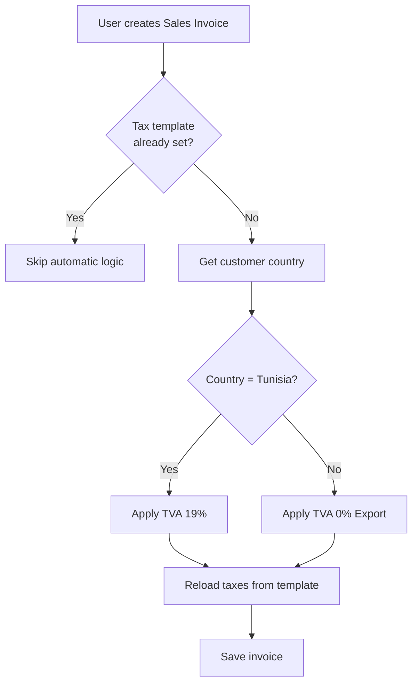
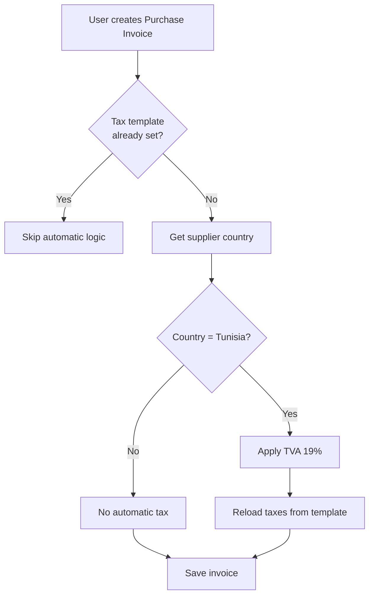

# Technical Guide - ERPNext Tunisian VAT App

## Overview

This document provides detailed technical information about the `erpnext_taxes_tn` custom app implementation.

## Architecture

### Design Principles

1. **No Core Modifications**: All functionality is implemented through Frappe's hook system
2. **Fixture-Based Configuration**: Tax rates and templates are defined as fixtures for easy deployment
3. **Event-Driven Logic**: Business logic is triggered via document events (before_save)
4. **Multi-Tenant Compatible**: Designed to work in SaaS/multi-site environments

### Component Breakdown

#### 1. Hooks System (`hooks.py`)

The hooks file configures the app and registers event handlers:

```python
doc_events = {
    "Sales Invoice": {
        "before_save": "erpnext_taxes_tn.taxes.apply_tunisia_tva"
    },
    "Purchase Invoice": {
        "before_save": "erpnext_taxes_tn.taxes.apply_tunisia_tva"
    }
}
```

**Key Points**:
- Uses `before_save` event to intercept invoice creation
- Same function handles both Sales and Purchase Invoices
- Non-intrusive - doesn't modify core ERPNext code

#### 2. Business Logic (`taxes.py`)

##### Main Function: `apply_tunisia_tva(doc, method=None)`

**Flow**:
1. Check if tax template is already set (skip if manual override)
2. Determine transaction type (Sales or Purchase)
3. Get party (Customer or Supplier) country
4. Call `get_tax_template()` to determine correct template
5. Apply template and reload taxes

**Code Example**:
```python
def apply_tunisia_tva(doc, method=None):
    if doc.taxes_and_charges:
        return  # Don't override manual selection
    
    party_type = "Customer" if doc.doctype == "Sales Invoice" else "Supplier"
    party_name = doc.customer if doc.doctype == "Sales Invoice" else doc.supplier
    
    if not party_name:
        return
    
    party = frappe.get_doc(party_type, party_name)
    tax_template = get_tax_template(
        party_country=party.country,
        is_sales=doc.doctype == "Sales Invoice",
        company=doc.company
    )
    
    if tax_template:
        doc.taxes_and_charges = tax_template
        doc.taxes = []
        doc.set_taxes()
```

##### Helper Function: `get_tax_template(party_country, is_sales, company)`

**Logic**:
- If party country = "Tunisia" → Local transaction → 19% VAT
- If party country ≠ "Tunisia" and Sales → Export → 0% VAT
- If party country ≠ "Tunisia" and Purchase → No automatic tax

**Decision Tree**:
```
Is party in Tunisia?
├── Yes → Apply "Tunisia - [Sales/Purchase] TVA 19%"
└── No
    ├── Is Sales? → Apply "Tunisia - Export TVA 0%"
    └── Is Purchase? → No automatic tax (return None)
```

#### 3. Fixtures

##### Tax Category
Defines "Tunisia" as a tax category for proper segregation.

##### Item Tax Templates
Four templates for different rates:
- Tunisia TVA 19% (Standard)
- Tunisia TVA 13% (Reduced)
- Tunisia TVA 7% (Super Reduced)
- Tunisia TVA 0% (Export/Exempt)

##### Sales Taxes and Charges Templates
Templates for sales transactions:
- Tunisia - Sales TVA 19%
- Tunisia - Sales TVA 13%
- Tunisia - Sales TVA 7%
- Tunisia - Export TVA 0%

Each template includes:
- `charge_type`: "On Net Total"
- `account_head`: Tax account (e.g., "TVA 19% - TN")
- `rate`: Tax percentage
- `tax_category`: "Tunisia"

##### Purchase Taxes and Charges Templates
Templates for purchase transactions:
- Tunisia - Purchase TVA 19%
- Tunisia - Purchase TVA 13%
- Tunisia - Purchase TVA 7%

##### Tax Rules
Automatic rules to apply templates based on conditions:

**Sales Rule - Local**:
```json
{
    "tax_type": "Sales",
    "billing_country": "Tunisia",
    "sales_tax_template": "Tunisia - Sales TVA 19%",
    "priority": 1
}
```

**Sales Rule - Export**:
```json
{
    "tax_type": "Sales",
    "billing_country": "",  // Any country except Tunisia
    "sales_tax_template": "Tunisia - Export TVA 0%",
    "priority": 2
}
```

## Business Logic Flow

### Sales Invoice Creation



### Purchase Invoice Creation



## Extension Points

### Adding New Tax Rates

To add a new tax rate (e.g., 6%):

1. **Create Item Tax Template**:
```json
{
    "doctype": "Item Tax Template",
    "name": "Tunisia TVA 6%",
    "taxes": [
        {
            "tax_type": "TVA 6% - TN",
            "tax_rate": 6.0
        }
    ]
}
```

2. **Create Sales/Purchase Templates**:
```json
{
    "doctype": "Sales Taxes and Charges Template",
    "name": "Tunisia - Sales TVA 6%",
    "taxes": [
        {
            "charge_type": "On Net Total",
            "account_head": "TVA 6% - TN",
            "rate": 6.0
        }
    ]
}
```

3. **Update fixtures in hooks.py**:
```python
fixtures = [
    {
        "dt": "Item Tax Template",
        "filters": [["name", "in", [
            "Tunisia TVA 19%",
            "Tunisia TVA 13%",
            "Tunisia TVA 7%",
            "Tunisia TVA 6%",  # Add new rate
            "Tunisia TVA 0%"
        ]]]
    }
]
```

### Custom Business Logic

To add custom logic (e.g., industry-specific rules):

1. **Create new function in taxes.py**:
```python
def apply_industry_specific_tax(doc, method=None):
    """Apply industry-specific tax rules"""
    if doc.custom_industry == "Healthcare":
        # Apply reduced rate for healthcare
        doc.taxes_and_charges = "Tunisia - Sales TVA 7%"
        doc.set_taxes()
```

2. **Register in hooks.py**:
```python
doc_events = {
    "Sales Invoice": {
        "before_save": [
            "erpnext_taxes_tn.taxes.apply_tunisia_tva",
            "erpnext_taxes_tn.taxes.apply_industry_specific_tax"
        ]
    }
}
```

## Multi-Tenant Considerations

### Company-Specific Templates

The fixtures use empty `company` field to make templates available to all companies. For company-specific templates:

```json
{
    "doctype": "Sales Taxes and Charges Template",
    "name": "Tunisia - Sales TVA 19% - Company A",
    "company": "Company A",
    "taxes": [...]
}
```

### Site-Specific Configuration

Each site can have different tax accounts. Ensure tax accounts exist before installing:

```bash
# Check if tax accounts exist
bench --site your-site.local console

>>> frappe.db.exists("Account", "TVA 19% - TN")
```

## Performance Considerations

### Caching

The app uses Frappe's built-in caching for:
- Customer/Supplier documents
- Tax templates
- Tax rules

### Optimization Tips

1. **Avoid Redundant Queries**: Customer/Supplier country is fetched once per invoice
2. **Early Returns**: Function exits early if tax template already set
3. **Minimal Processing**: Only processes invoices without existing tax templates

## Security

### Permissions

The app respects ERPNext's built-in permission system:
- Users need "Create" permission on Sales/Purchase Invoice
- Tax template selection follows role permissions

### Data Validation

The app includes validation to prevent:
- Applying wrong tax rates
- Missing tax accounts
- Invalid tax templates

## Debugging

### Enable Logging

```python
# In taxes.py, add logging
import frappe

frappe.logger().info(f"Applying tax to {doc.name}")
frappe.logger().debug(f"Party country: {party_country}")
```

### Check Logs

```bash
# View logs
bench --site your-site.local console

>>> frappe.get_all("Error Log", limit=10)
```

### Common Issues

**Issue**: Tax not applied
- **Check**: Customer/Supplier has country set
- **Check**: Tax accounts exist
- **Check**: Fixtures loaded correctly

**Issue**: Wrong tax rate
- **Check**: Tax Rules priority
- **Check**: Item-specific tax templates
- **Check**: Manual override not set

## Testing Strategy

### Unit Tests

Create unit tests for core functions:

```python
# tests/test_taxes.py
import frappe
import unittest
from erpnext_taxes_tn.taxes import get_tax_template

class TestTunisiaTaxes(unittest.TestCase):
    def test_local_sales_tax(self):
        template = get_tax_template(
            party_country="Tunisia",
            is_sales=True,
            company="Test Company"
        )
        self.assertEqual(template, "Tunisia - Sales TVA 19%")
    
    def test_export_sales_tax(self):
        template = get_tax_template(
            party_country="France",
            is_sales=True,
            company="Test Company"
        )
        self.assertEqual(template, "Tunisia - Export TVA 0%")
```

### Integration Tests

Test full invoice creation flow:

```python
def test_sales_invoice_local():
    # Create customer in Tunisia
    customer = frappe.get_doc({
        "doctype": "Customer",
        "customer_name": "Test Customer TN",
        "country": "Tunisia"
    }).insert()
    
    # Create sales invoice
    invoice = frappe.get_doc({
        "doctype": "Sales Invoice",
        "customer": customer.name,
        "items": [{"item_code": "Test Item", "qty": 1, "rate": 100}]
    }).insert()
    
    # Verify tax applied
    assert invoice.taxes_and_charges == "Tunisia - Sales TVA 19%"
```

## Deployment

### Production Checklist

- [ ] Verify all tax accounts exist in Chart of Accounts
- [ ] Test with sample invoices
- [ ] Backup database before installation
- [ ] Install on staging first
- [ ] Verify fixtures loaded correctly
- [ ] Test export transactions
- [ ] Test item-specific tax rates
- [ ] Train users on manual override capability

### Rollback Plan

If issues occur:

```bash
# Uninstall app
bench --site your-site.local uninstall-app erpnext_taxes_tn

# Restore backup
bench --site your-site.local restore /path/to/backup
```

## Maintenance

### Updating Tax Rates

If tax rates change:

1. Update fixtures JSON files
2. Export new fixtures: `bench --site your-site.local export-fixtures`
3. Increment version in `pyproject.toml`
4. Run migration: `bench --site your-site.local migrate`

### Monitoring

Monitor app performance:

```bash
# Check error logs
bench --site your-site.local console

>>> frappe.db.get_all("Error Log", 
...     filters={"error": ["like", "%tunisia%"]},
...     limit=20)
```

## Support and Resources

- **ERPNext Forum**: https://discuss.erpnext.com
- **Frappe Framework Docs**: https://frappeframework.com/docs
- **Source Code**: Review `taxes.py` for implementation details

## Changelog

### v1.0.0 (2026-01-30)
- Initial release
- Support for 19%, 13%, 7%, 0% VAT rates
- Automatic tax application
- Export handling
- Item-specific tax rates
